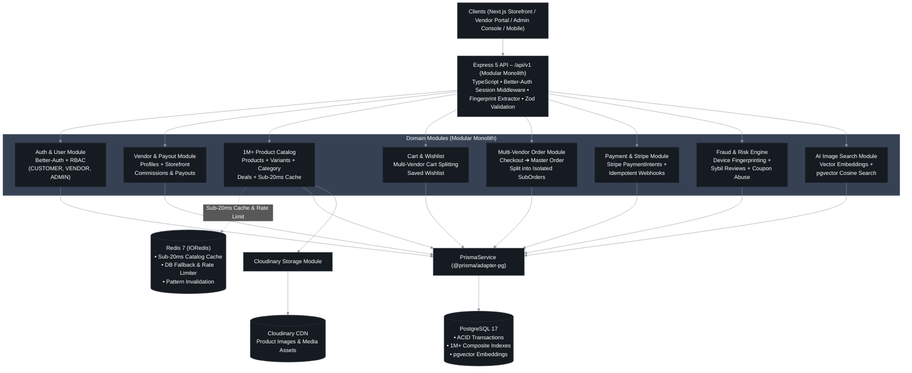
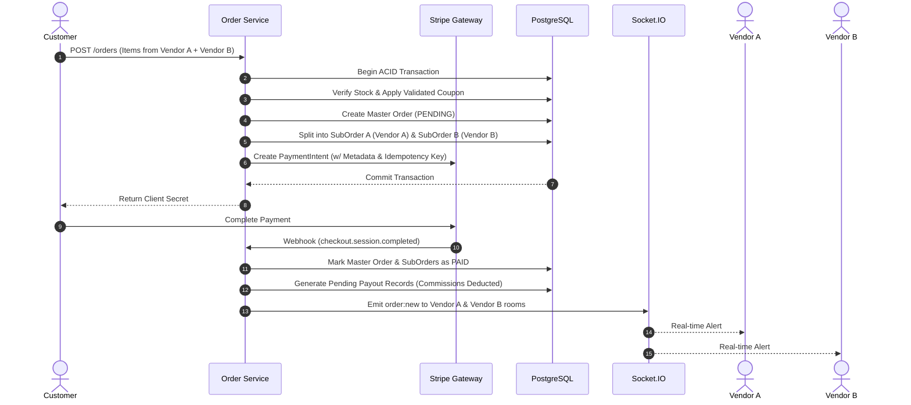
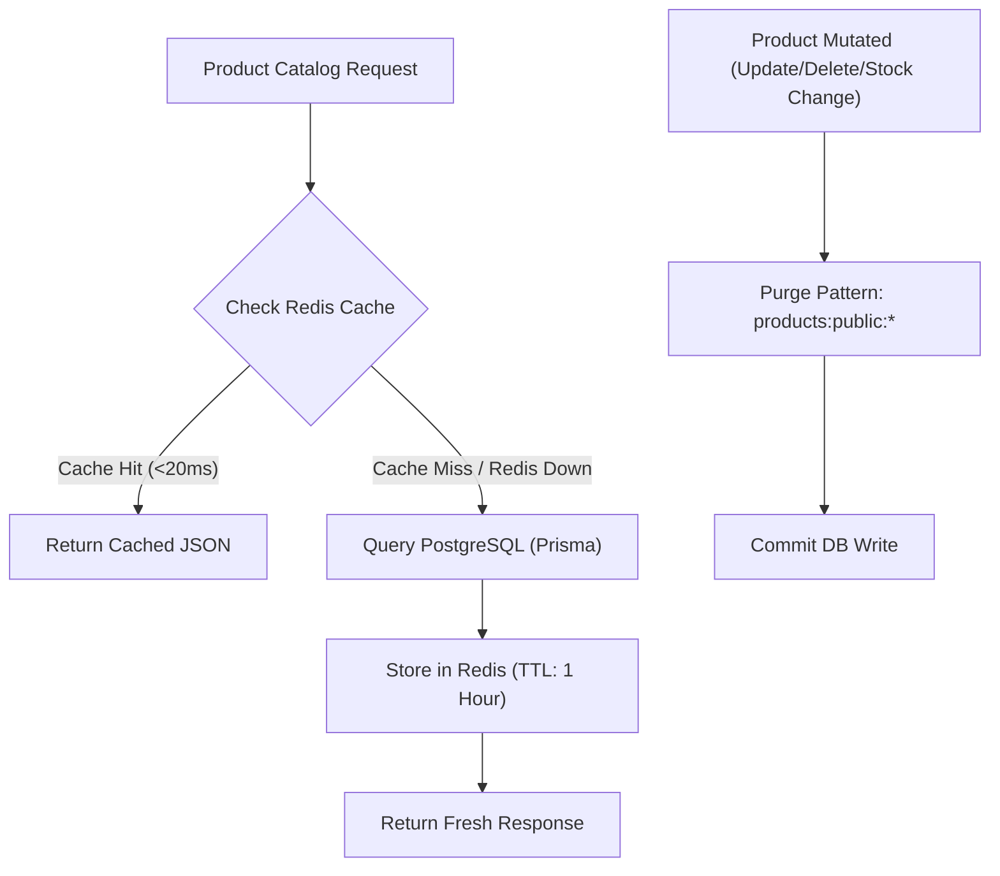
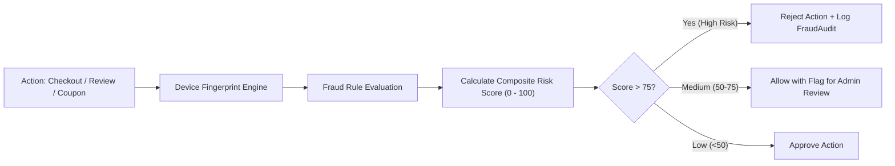

# 🏗️ System Architecture: Production-Grade Multi-Vendor E-Commerce Platform

This document outlines the end-to-end system architecture, design patterns, data flow, and scaling strategies for the **Multi-Vendor E-Commerce Backend**.

> [!TIP]
> 🎨 **Interactive Architecture Diagram**:
> - ✏️ **[Download Editable Draw.io File (Google Drive)](https://drive.google.com/file/d/14d68AaZ_GSTuUge-DTK02I8edDlXh4qj/view?usp=sharing)**
> 
> **How to use in Draw.io:**
> 1. Download the diagram from Google Drive.
> 2. Open **[app.diagrams.net](https://app.diagrams.net/)**.
> 3. Click **Open Existing Diagram** (or drag & drop the downloaded file) to view, edit, or export as PNG/PDF/SVG.


---


## 1. High-Level System Topology




---

## 2. Core Architectural Highlights

### A. Multi-Vendor Order Splitting & Escrow Pipeline
When a customer purchases products across multiple independent vendors in a single checkout:
1. **Master Order Creation**: An umbrella transaction is generated for the customer.
2. **Sub-Order Decomposition**: The order is decomposed into isolated `sub_orders` by `vendor_id`.
3. **Escrow & Commission Calculation**: Platform commission and vendor payout ledgers are calculated at the line-item level.
4. **Idempotent Webhooks**: Stripe webhook handling guarantees that payments are only credited once through event-id deduplication.
5. **Real-time Dispatch**: Socket.IO triggers push events directly to each vendor's private room.



---

### B. High-Performance Redis Caching & Invalidation Layer
* **Performance Gain**: Product queries drop from **~1,800ms to <20ms**.
* **Zero-Downtime Fallback**: If Redis becomes unavailable, the system automatically falls back to PostgreSQL without interrupting user traffic.
* **Targeted Invalidation**: Invalidation occurs via key pattern matching (`products:public:*`) immediately upon write operations (create, update, delete, stock change).



---

### C. Advanced Risk & Fraud Detection Engine
Prevents voucher abuse, fake review rings (Sybil attacks), and fraudulent multi-accounting:
* **Device Fingerprinting**: Aggregates browser canvas, screen resolution, IP, and hardware markers to detect multiple accounts on one physical machine.
* **Review Verification**: Reviews can only be submitted by verified buyers of the exact sub-order.
* **Coupon Abuse Guard**: Atomic coupon usage checks prevent race conditions during flash sales.



---

### D. AI Vector Image Search
* **Visual Search**: Generates vector embeddings for product images.
* **Similarity Search**: Performs cosine-distance similarity queries via PostgreSQL vector indexing to allow buyers to find products via image upload.

---

## 3. Layered Modular Architecture

The application is structured into decoupled domain modules following clean separation of concerns:

```
src/
├── app.ts                         # Express app setup, security middlewares, route mounting
├── server.ts                      # Cluster/server lifecycle & graceful shutdown
└── app/
    ├── config/                    # Environment, Stripe, Redis & Cloudinary configs
    ├── errors/                    # Global AppError, Zod & Prisma error formatting
    ├── lib/                       # Prisma client, Better-Auth, Redis client, Nodemailer
    ├── middlewares/               # Auth, RBAC, Rate-limiting, Fingerprinting, Validation
    ├── modules/                   # 20+ Domain Feature Modules
    │   └── {domain}/
    │       ├── {domain}.controller.ts   # HTTP Request/Response handling
    │       ├── {domain}.service.ts      # Core business logic & database transactions
    │       ├── {domain}.route.ts        # Route definitions with middlewares
    │       ├── {domain}.validation.ts   # Zod input schemas
    │       └── {domain}.types.ts        # TypeScript typings
    ├── routes/                    # Versioned route aggregator (/api/v1)
    ├── shared/                    # catchAsync, sendResponse, QueryBuilder
    ├── templates/                 # EJS HTML email templates
    └── utils/                     # Logger, cookie helpers, formatting utilities
```

---

## 4. Scalability, Security & Production Checklist

| Category | Implementation |
| :--- | :--- |
| **Authentication & RBAC** | Better-Auth session cookies with `CUSTOMER`, `VENDOR`, `ADMIN`, `SUPER_ADMIN` roles |
| **Database Performance** | B-Tree & composite indexes on high-cardinality search columns; 1M+ seed tested |
| **High Concurrency** | Load-tested with Autocannon (1,400+ concurrent req/sec with 0 errors) |
| **Input Validation** | Strict Zod validation on request parameters, queries, and bodies |
| **Error Handling** | Standardized JSON envelope: `{ success, statusCode, message, meta, data }` |
| **Graceful Shutdown** | Intercepts `SIGTERM`/`SIGINT` to close database pools and WebSocket connections safely |
