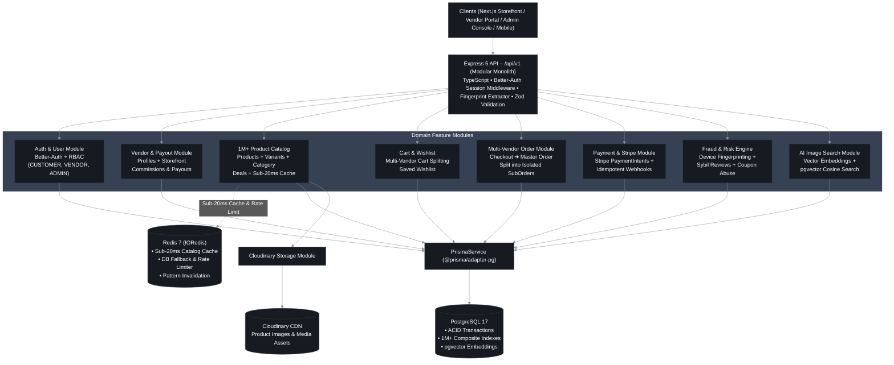
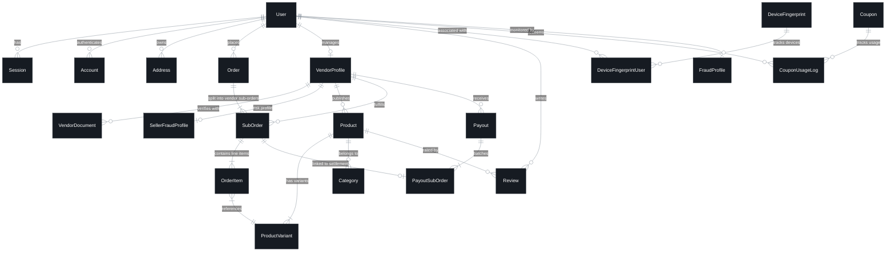

# 🛍️ Multi-Vendor E-Commerce Platform API

[](https://www.typescriptlang.org/)
[](https://nodejs.org/)
[](https://expressjs.com/)
[](https://www.postgresql.org/)
[](https://www.prisma.io/)
[](https://redis.io/)
[](https://stripe.com/)
[](https://github.com/FuadTalukder85/multi-vendor-e-commerce-backend)


A production-grade, high-throughput multi-vendor e-commerce backend built with **Express 5**, **TypeScript**, **PostgreSQL (pgvector)**, **Prisma ORM**, and **Redis 7**. 

Architected as a clean **Modular Monolith**, it implements session-based authentication with Better-Auth, granular database-driven RBAC, atomic multi-vendor order decomposition, automated vendor payout calculation, real-time risk & device fingerprint fraud scoring, an AI-powered visual similarity search engine (pgvector), and an ultra-low latency Redis caching layer tested against **1,000,000+ catalog items**.

---

## 📑 Table of Contents

- [Executive Overview](#-executive-overview)
- [System Architecture](#️-system-architecture)
- [Database Design & ERD](#-database-design--entity-relationship-diagram)
- [Core Engineering Highlights](#-core-engineering-highlights)
- [Tech Stack](#-tech-stack)
- [Domain Modules](#-domain-modules-breakdown)
- [Redis Caching & High-Scale Performance](#-redis-caching--high-scale-performance)
- [Security & Fraud Detection](#-security--fraud-detection-engine)
- [Project Structure](#-project-structure)
- [Getting Started & Local Setup](#-getting-started--local-setup)
- [API Specifications & Response Format](#-api-specifications--response-format)

---

## 🌐 Executive Overview

The platform coordinates a multi-party marketplace ecosystem with four primary actors:

```
                  ┌─────────────────────────────────────────────────────────┐
                  │                    Platform Actors                      │
                  └───────┬──────────────┬──────────────┬─────────────┬─────┘
                          │              │              │             │
                          ▼              ▼              ▼             ▼
                   ┌────────────┐ ┌────────────┐ ┌────────────┐ ┌────────────┐
                   │  Customer  │ │   Vendor   │ │   Admin    │ │Super Admin │
                   └────────────┘ └────────────┘ └────────────┘ └────────────┘
```

1. **Customer Flow**: Register / authenticate ➔ browse 1M+ catalog with sub-20ms cached search ➔ reverse-image search ➔ multi-vendor cart ➔ checkout with atomic order splitting ➔ Stripe payment ➔ track vendor-specific sub-orders & submit verified reviews.
2. **Vendor Flow**: Onboard vendor profile (`PENDING`) ➔ Admin verification ➔ manage shop & variants ➔ receive isolated `SubOrder` alerts via Socket.IO ➔ fulfill orders ➔ receive automated payout settlements with transparent commission logs.
3. **Admin / Super Admin Flow**: Granular RBAC permissions ➔ platform settings & taxonomy ➔ dispute handling ➔ inspect device fingerprint fraud graph ➔ approve/settle vendor payout batches.

---

## 🏛️ System Architecture

The system is structured as a layered **Modular Monolith** with strict domain boundaries and decoupled transport, service, and persistence layers.



> [!TIP]
> 🎨 **Interactive Diagram File & Specifications**:
> - 📄 Full Architecture Breakdown: [`ARCHITECTURE.md`](./ARCHITECTURE.md)
> - ✏️ **[Download Editable Draw.io Diagram (Google Drive)](https://drive.google.com/file/d/14d68AaZ_GSTuUge-DTK02I8edDlXh4qj/view?usp=sharing)**
> 
> **How to open in Draw.io:**
> 1. Download the file from Google Drive.
> 2. Open **[app.diagrams.net](https://app.diagrams.net/)** in your browser.
> 3. Click **Open Existing Diagram** (or drag & drop the file) to inspect, customize, or export as vector SVG/PDF.

---

## 🗄️ Database Design & Entity Relationship Diagram

Our schema is built for **ACID transactional integrity**, **multi-vendor data isolation**, and **high-scale querying** with PostgreSQL 17 and Prisma 7:



### 📊 Database Domain Breakdown

| Domain | Key Models | Architectural Responsibility |
|---|---|---|
| **Identity & Access** | `User`, `Session`, `Account`, `Role`, `Permission` | Better-Auth integration, granular RBAC, session cookie management. |
| **Vendor & Governance** | `VendorProfile`, `VendorDocument`, `SellerFraudProfile` | Vendor onboarding state machine (`PENDING` ➔ `VERIFIED` ➔ `ACTIVE`). |
| **Catalog & Inventory** | `Product`, `ProductVariant`, `Category`, `Deal` | SKU-level stock control, composite indexes for 1M+ catalog search. |
| **Commerce & Splitting** | `Order`, `SubOrder`, `OrderItem` | Single-transaction order decomposition across multi-seller carts. |
| **Payouts & Settlement** | `Payout`, `PayoutSubOrder` | Line-item commission deductions & vendor escrow ledger. |
| **Promotions** | `Coupon`, `CouponUsageLog` | Atomic race-condition safe coupon redemption with per-user usage limits. |
| **Risk & Fraud** | `DeviceFingerprint`, `FraudProfile`, `FraudAuditLog` | Device canvas/IP hashing, Sybil review prevention, velocity anomaly flags. |
| **Media & AI Search** | `ProductImage`, `pgvector Embeddings` | Visual similarity cosine distance queries & Cloudinary CDN sync. |

---

## ⚡ Core Engineering Highlights

### 1. Atomic Multi-Vendor Order Splitting Pipeline
When a cart contains items from multiple vendors, checkout executes within a **single ACID transaction**:
- Verifies stock and locks inventory rows (`SELECT ... FOR UPDATE`).
- Generates a customer-facing `Order` (tracking overall payment status).
- Automatically decomposes the order into isolated `SubOrder` records by `vendor_id`.
- Emits real-time WebSocket events (`Socket.IO`) exclusively to each vendor's room upon successful payment.

### 2. Sub-20ms Redis Caching with Zero-Downtime Fallback
- **Performance**: High-throughput cache-aside pattern reducing product catalog query latency from **~1,800ms down to <20ms**.
- **Resilient Fallback**: If Redis experiences connection failure, `ioredis` intercepts the error and seamlessly falls back to PostgreSQL without 500 errors.
- **Surgical Invalidation**: Write operations (create, edit, delete, stock update) trigger targeted key purging (`products:public:*`) rather than flushing global cache.
- **Benchmarked**: Load-tested with Autocannon handling **1,400+ concurrent req/s** with 0 timeouts or dropped packets.

### 3. Real-Time Risk & Fraud Scoring Engine
- **Device Fingerprinting**: Extracts canvas, hardware concurrency, IP, and header heuristics to detect multi-account voucher farming.
- **Verified Buyer Reviews**: Reviews require authenticated purchase verification tied to completed `SubOrder` IDs.
- **Sybil Ring Detection**: Flags abnormal rating spikes and cross-vendor review collusion.

### 4. AI-Powered Visual Similarity Search
- Converts product hero images into vector embeddings.
- Leverages PostgreSQL **pgvector** cosine distance similarity (`/api/v1/image-search`) to enable reverse image shopping.

---

## 🛠️ Tech Stack

```
Runtime:         Node.js 20+ (LTS)
Framework:       Express.js 5.2 (TypeScript Strict Mode)
Database:        PostgreSQL 17 (Prisma 7 with @prisma/adapter-pg)
Vector Search:   pgvector (Cosine Distance Similarity)
Cache & Lock:    Redis 7 (IORedis)
Authentication:  Better Auth (Session-based, HttpOnly Cookies, Granular RBAC)
Payment Engine:  Stripe (PaymentIntents + Idempotent Webhooks)
Validation:      Zod 4 (Strict DTO Schema Validation)
Media CDN:       Multer + Cloudinary
Realtime Push:   Socket.IO 4.8
Emails:          Nodemailer + EJS HTML Template Engine
Package Manager: pnpm (v10)
```

---

## 📁 Project Structure

Following a **Modular Monolith** architecture, each domain is isolated with dedicated controllers, services, routes, and validation schemas:

```
src/
├── app.ts                         # Express app bootstrap, security middlewares, routing
├── server.ts                      # Cluster lifecycle, Redis connection, graceful shutdown
└── app/
    ├── config/                    # Environment, Stripe, Redis & Cloudinary configs
    ├── errors/                    # Global AppError, Zod & Prisma error formatting
    ├── lib/                       # Prisma client, Better-Auth, Redis client, Nodemailer
    ├── middlewares/               # Auth, RBAC, Rate-limiting, Fingerprinting, Validation
    ├── modules/                   # 20+ Domain Feature Modules
    │   ├── auth/                  # Better-Auth integration & session handlers
    │   ├── user/                  # User management & profile CRUD
    │   ├── vendorProfile/         # Vendor onboarding, KYC docs & settings
    │   ├── product/               # 1M+ catalog query builder & indexing
    │   ├── productVariant/        # SKU, price, attribute variants & inventory
    │   ├── cart/                  # Multi-vendor cart separation
    │   ├── order/                 # Checkout & master order pipeline
    │   ├── subOrder/              # Vendor-specific fulfillment lifecycle
    │   ├── payout/                # Vendor settlement & commission ledgers
    │   ├── coupon/                # Coupon validation & abuse prevention
    │   ├── review/                # Verified buyer reviews & rating aggregations
    │   ├── fraudProfile/          # Risk score calculator & audit logs
    │   ├── deviceFingerprint/     # Hardware/browser fingerprinting engine
    │   ├── imageSearch/           # AI vector image search pipeline
    │   └── notification/          # EJS email templates & Socket.IO push
    ├── routes/                    # Versioned API route aggregator (/api/v1)
    ├── shared/                    # catchAsync, sendResponse, QueryBuilder
    ├── templates/                 # EJS HTML email templates
    ├── types/                     # TypeScript type augmentations & interfaces
    └── utils/                     # Logger, cookie helpers, QueryBuilder
```

---

## 🚀 Getting Started & Local Setup

### Prerequisites
- **Node.js**: `>= 20.0.0`
- **PostgreSQL**: `>= 16`
- **Redis**: `>= 7`
- **pnpm**: `>= 9.0.0`

### 1. Clone & Install Dependencies
```bash
git clone https://github.com/FuadTalukder85/multi-vendor-e-commerce-backend.git
cd multi-vendor-e-commerce-backend
pnpm install
```


### 2. Environment Configuration
```bash
cp .env.example .env
```
Configure your `.env` variables with your PostgreSQL URL, Redis URL, Stripe keys, and Cloudinary credentials.

### 3. Database Migration & Seed
```bash
# Generate Prisma Client
pnpm prisma:generate

# Apply Database Migrations
pnpm prisma:migrate

# Seed Initial Roles, Categories & Test Data
pnpm prisma:seed

# (Optional) Seed 1 Million Products for Benchmarking
pnpm seed:1m
```

### 4. Run Development Server
```bash
pnpm dev
```
The server will start at `http://localhost:5000/api/v1`.

### 5. Available Scripts

| Script | Command | Description |
|---|---|---|
| `pnpm dev` | `tsx watch src/server.ts` | Start hot-reloading development server |
| `pnpm build` | `tsc` | Compile TypeScript into production JavaScript |
| `pnpm start` | `node dist/server.js` | Run compiled production bundle |
| `pnpm seed:1m` | `tsx scripts/seed-1m-products.ts` | Seed 1,000,000 products for stress testing |
| `pnpm test:load` | `tsx scripts/load-test.ts` | Run Autocannon high-concurrency benchmarks |
| `pnpm sync:embeddings` | `tsx scripts/sync-image-embeddings.ts` | Generate AI vector embeddings for catalog |
| `pnpm prisma:studio` | `prisma studio` | Open visual database browser |

---

## 📡 API Specifications & Response Format

All API endpoints follow a strict, standardized JSON response envelope:

### Standard Success Response (`200 OK / 201 Created`)
```json
{
  "success": true,
  "statusCode": 200,
  "message": "Products retrieved successfully",
  "data": [
    {
      "id": "prod_cm7abc123",
      "title": "Wireless Noise-Cancelling Headphones",
      "price": 199.99,
      "vendorId": "vend_xyz789",
      "category": "Electronics",
      "variants": [
        { "sku": "WNC-BLK", "color": "Black", "stock": 45 }
      ]
    }
  ],
  "meta": {
    "page": 1,
    "limit": 10,
    "total": 1000000,
    "totalPages": 100000
  }
}
```

### Standard Error Response (`400 / 401 / 403 / 404 / 500`)
```json
{
  "success": false,
  "message": "Validation Error",
  "errorSources": [
    {
      "path": "price",
      "message": "Price must be a positive number"
    }
  ]
}
```

---

## 🛡️ Production & Reliability Checklist

- [x] **Strict Type Safety**: TypeScript in strict mode with zero implicit `any`.
- [x] **Defense-in-Depth Validation**: Zod runtime schema validation on every route.
- [x] **Distributed Session Security**: HttpOnly, SameSite, Secure session cookie management.
- [x] **Concurrency Proven**: Atomic inventory reservation & coupon redemption under load.
- [x] **Graceful Shutdown**: Intercepts `SIGTERM` / `SIGINT` to safely drain connection pools.
- [x] **Idempotent Webhooks**: Stripe Event-ID deduplication preventing double charges.


